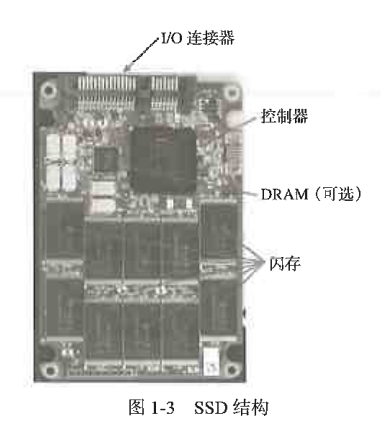
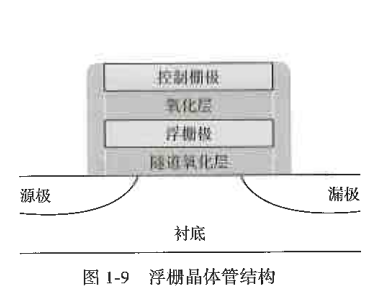
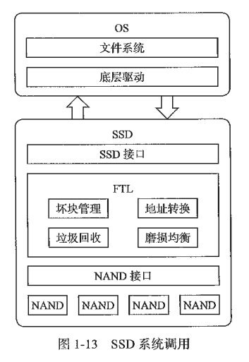
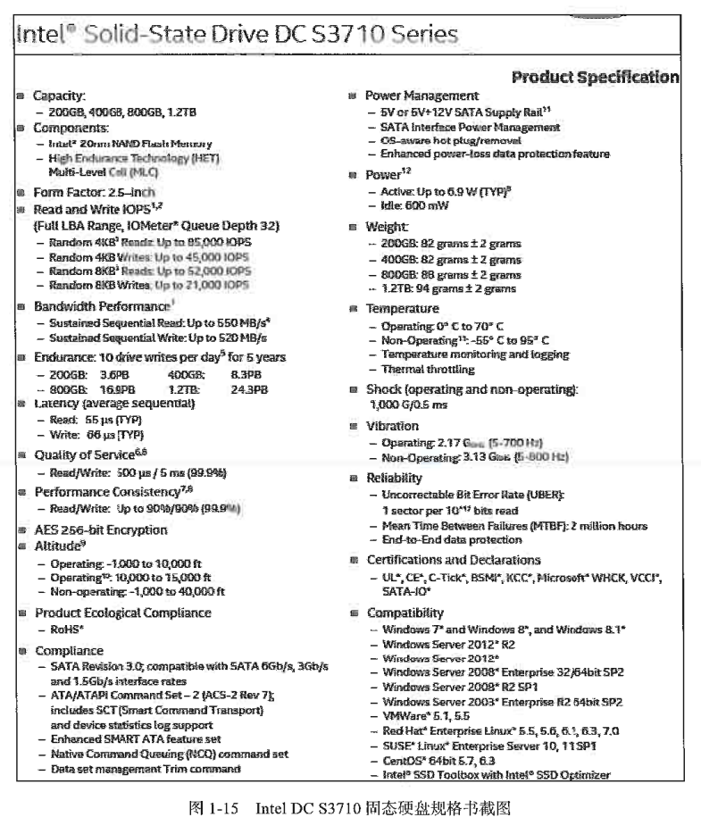

# SSD综述

SSD（Solid State Drive）即固态硬盘，是一种以半导体闪存（NAND Flash）为介质的存储设备。和传统机械硬盘（Hard Disk Drive, HDD）不同，SSD 以半导体存储数据，用纯电子电路实现，不含任何机械设备，这就决定了它在性能、功耗、可靠性等方面和 HDD 有很大不同。SSD 正在取代 HDD 成为主流的存储设备。

---

## 1.1 引子

SSD 的硬件实体主要包括以下几大部分：

* **主控 (Controller)**：SSD 的“大脑”，负责指挥所有数据的读写和管理。
* **闪存 (NAND Flash)**：主要的数据存储介质，决定了 SSD 的容量和寿命。
* **缓存芯片 DRAM**：(可选组件) 用于存放映射表和暂存数据以提升性能。部分低成本 SSD 可能没有独立 DRAM，仅使用主控内置的 SRAM (DRAM-less)。
* **PCB 板**：承载其他元器件，如电源管理芯片、电阻、电容等。
* **外部接口**：连接主机的物理通道，常见的有 SATA、SAS、PCIe 等。

   

[//]: # (到此为止，强制换行，并且下一行内容必须在图片的最下方开始，不能挤在图片旁边)

**固件 (Firmware, FW)** 是 SSD 的“灵魂”软件，负责调度从接口端到介质端的数据读写。其核心功能包括嵌入式的闪存介质寿命管理（如磨损均衡）、可靠性保障调度算法（如 ECC 纠错），以及垃圾回收 (GC) 等关键内部算法。

SSD 三大核心技术排列如下：**控制器 (Controller)**，**闪存 (NAND Flash)**，**固件 (Firmware)**

截至书中日期，闪存主要供应商：三星(Samsung),SK海力士(SK Hynix),铠侠（Kioxia，西数（WD），长存(YMTC)

---

## 1.2 SSD与HDD(to be continue)

---

## 1.3 固态存储及SSD技术发展史(to be continued)

---

## 1.4 SSD基本工作原理(to be continued)

---

## 1.5 SSD产品核心指标(to be continued)

SSD 的几大核心指标基本信息：

- 包括容量配置（Capacity）、介质信息（Component）、外观尺寸（Form Factor）、重量（Weight）、环境温度（Temperature）、震动可靠性（Shock and Vibration）、认证（Certification）、加密（Encryption）等信息。
- 性能指标：连续读写带宽、随机读写 IOPS、时延（Latency）、最大时延（Quality of Service）。
- 数据可靠性（Reliability）和寿命（Endurance）。
- 功耗：功耗管理（Power Management）、工作功耗（Active Power）和空闲功耗（Idle Power）。
- 兼容性等：适配性（Compliance）、兼容性（Compatibility，与操作系统集成时参考）。

还有其他一些重要信息是无法在产品规范书里体现的，比如产品可靠性（RMA Rate）。由固件或者硬件缺陷导致的产品返修率的高低是很关键的指标，在保质期内产品返修率越低越好。尤其是企业级硬件，数据比 SSD 本身更重要，用户不能容忍的是由固件、硬件可靠性问题或缺陷导致丢数据，或者数据无法通过技术手段恢复。

产品的测试条件信息、产品的系统兼容性信息等也是无法在产品规范书里体现的。这些也考验购买 SSD 的用户对 SSD 理解的深度。从测试条件的苛刻设计中提炼出用户想要的测试用例，用测试结果来反映产品规范书里无法透露和显示的产品的实际数据信息。当然，能通过苛刻的测试，并在实际上线运行中经受住系统的考验，日积月累，产品的品牌就打出来了。每家 SSD OEM 客户都有自己的标准和测试，以求通过实际测试和运行数据检验出质量好或差的 SSD 供应商。

### 1.5.1 基本信息剖析

---

## 1.6 接口形态(to be continued)
