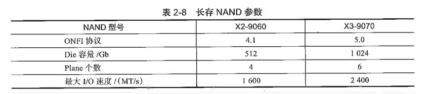
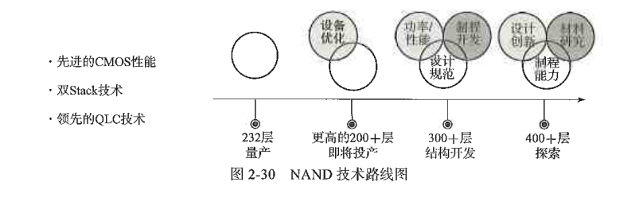
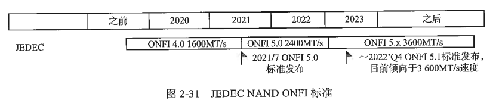
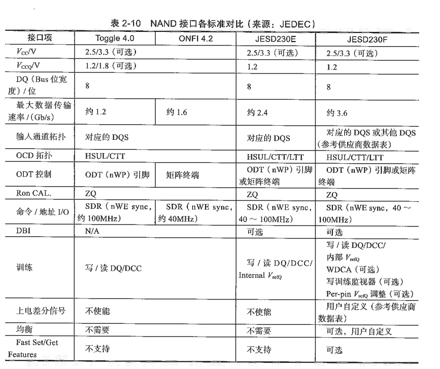
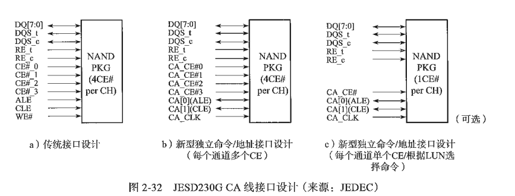

# SSD及闪存市场

---

## 2.1 SSD市场(to be continued)

---

## 2.2 闪存市场(to be continued)

### 2.2.1 最新原厂动态

#### 1.3D NAND的发展

#### 2.NAND产能

#### 3.NAND参数对比

#### 4.长江存储

国内厂商长江存储在 3D NAND 上发展非常不错，其产品在各项性能指标上均可以追平同类型的国际原厂 NAND。

产品方面，长存紧跟业界 3D NAND 的堆叠层数，以开先河的 Xtacking® 晶栈高速 I/O 架构来设计 NAND 产品。完成 NAND 的发展之后，长存开始布局系统级解决方案，包括 SSD 产品。

长存的最新 NAND、Xtacking® 晶栈技术及最新 SSD 产品。

（1）TLC NAND：X2-9060 和 X3-9070
X2-9060：长存于 2021 年量产 128 层 X2-9060 TLC NAND，Die 大小为 512Gb，Plane 的个数是 4。得益于 Xtacking® 晶栈架构，该产品的 I/O 速度做到了 1 600MT/s，与其他国际原厂 176 层的速度相同，这是当年已量产的 NAND 中最高的接口速度。

X3-9070：X3-9070 TLC NAND 支持的协议从 ONFI 4.1 升级到 ONFI 5.0，也就是支持最高速度 2 400MT/s，这不仅会提升 NAND I/O 速度，还会大大提升系统性能。它的 Plane 个数为 6，并完整支持 AMPI（Asynchronous Multi-Plane Independent，异步独立多平面），这极大提升了闪存读写的并发度，尤其极大提升了系统随机读取的性能。X3-9070 的推出，在同一时期基本追平国际原厂的最新 NAND 产品参数。

### 2.2.2 闪存发展趋势(to be continued)

3D 闪存发展将一直围绕层数、I/O 速度和性能 3 个维度展开，层数解决单位 GB 成本问题（增加位密度），I/O 速度和性能解决不断增长的用户性能需求问题。

#### 1. 层数

某 SSD 大厂发布的路标图，预计 2022 年底发布新品 232 层 NAND，接口速度将会是 ONFI 5.0 的速度。 往后将是 200+、300+、400+ 层，按过去的 NAND 发布节奏，两代产品间隔的时间为 1.5 ~ 2 年，所以 5 年后或许能看到 400+ 层的 NAND。 从图 2-30 中可以看出，各家对 NAND 层数的追逐到了“卷”的时代，加上产能的增加，可预见的是后续几年各大闪存厂商将进入疯狂“盖楼”的时代。

层数的增加也给 NAND 带来如下挑战。

- 层数增加，层与层之间的差异更大，在层间打洞也会更难。
- 可靠性会越来越差，NAND 设计上需要更多额外 Spare 数据及具有更强纠错能力的 LDPC。
- 层数增加，页数会随之增多，这会导致块变得更大，这对固件设计提出更大挑战，例如垃圾回收需要搬移更多的数据，关闭一个块需要填充更多的数据，耗时更长，处理命令延时更长。

#### 2.接口速度

原则上 NAND 的接口速度跟随 ONFI、Toggle 的标准，目前市面上已量产的 NAND 最高速度是 1 600MT/s。最新 JEDEC 组织定义的 ONFI 5.0 是 2 400MT/s，2022 年 8 月推出的 200+ 层 NAND 产品会搭配这个速度。ONFI 5.1 标准正在制定中，从目前趋势来看，会向 3 000MT/s 以上速度发展，如图 2-31 所示。再看 PCIe 速度的发展，PCIe 3.0 之前是每 5 ~ 6 年发展一代，但从 4.0 到 5.0 只隔了 2 年，6.0 标准的出现更是势不可当。标准有了，适配 PCIe 接口的各行各业的产品开始涌现，NAND 接口速度和前端（PCIe）速度同步向前发展，先有标准，再找应用场景和产品。

如此高的 I/O 速度怎么样才能被发挥出来呢？诸如 PCIe 4.0&5.0 SSD 和 UFS 3.1&4.0 等产品，前端大带宽需要后端高速 NAND I/O 与之匹配。以 PCIe 4.0 x4 cSSD 为例，前端带宽为 8GB/s，如果 NAND I/O 速度为 1 200MT/s，控制器后端需要 8 通道；如果 NAND I/O 速度达到 2 400MT/s，控制器后端 8 通道则可降低为 4 通道，从而降低控制器成本和功耗，带来整体 SSD 成本和功耗的降低。12未来几年，更高速的 PCIe 5.0 SSD 也可借助更高速的 NAND I/O 来满足前端带宽的需求。34有关接口速度，下面具体看 JESD230F 标准的定义。JESD230F 是面向 ONFI 5.1 的标准，目前大致的草稿已经完成，它相比于之前的标准最大的变化是接口速度从 2.4GT/s 提升到 3.6GT/s，NAND 厂商可按需设计为 25.8GT/s、3.2GT/s 或 3.6GT/s。其他的接口电压（如 $V_{CCQ}$ 为 1.2V、$V_{CC}$ 为 2.5V/3.3V）保持不变，DQ 位宽为 8 位。具体如表 2-10 所示。

#### 3.长期技术路线

前文提到，外围 CMOS 电路与存储器阵列有两种设计架构，一种是以长江存储为代表的 Xtacking® 晶栈 CMOS 电路与存储器阵列分离式架构，另一种是其他国际原厂采用的传统的 CnA、CuA 及 PuC 等 CMOS 电路与存储器阵列不分离式架构。NAND I/O 越来越快，传统的不分离式架构受到的挑战越来越大。以 Xtacking® 晶栈为代表的分离式架构设计，由于 CMOS 电路在单独的晶圆上独立设计与生产，所以可以使用更好的制程和更优的设计方案。

