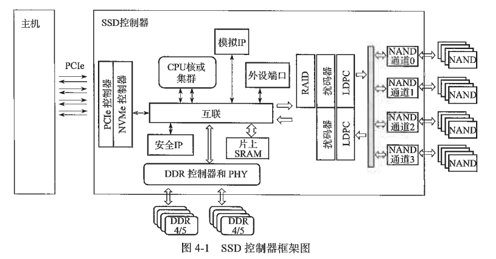

# SSD 主控

---

## 4.1 解读控制器架构(to be continued)

控制器作为一个片上系统，处理来自用户端的命令并负责管理闪存颗粒。整个控制器的架构主要包括以下几个模块（见图 4-1）。

- 前端主机接口模块：比如 PCIe 控制器和存储协议 NVMe 控制器。
- 后端闪存接口模块：用于直接和闪存交互，是控制器和闪存交互的通道，一个通道上可挂载多个闪存颗粒。
- 后端数据处理模块：如 RAID、扰码器和 LDPC，又称数据处理单元。
- DDR 控制器和 PHY：用于和 DRAM 交互。
- 加解密以及认证的安全模块：负责硬件和数据安全。
- 负责指挥整个系统和协调各个硬件计算系统的 CPU 以及互连系统。
- 其他：如片上 SRAM、模拟 IP 和外设端口等。

#### 1. PCIe 和 NVMe 控制器前端子系统

PCIe 和 NVMe 控制器前端子系统有时也被称为主机子系统，主要用于处理来自主机以及协议接口的各种命令。PCIe 决定了整个控制器的前端和用户交互带宽，目前主流的消费级控制器主要是 4 个通道，企业级控制器可能具备 8 个甚至更多的通道以满足带宽的需求。PCIe PHY（物理接口）作为高速接口，是控制器的核心 IP。PCIe PHY 的主要玩家有新思科技（Synopsys）、楷登电子（Cadence）和蓝铂世科技（Rambus）等 IP 供应商。

---

## 4.2 SSD主控厂商(to be continued)
