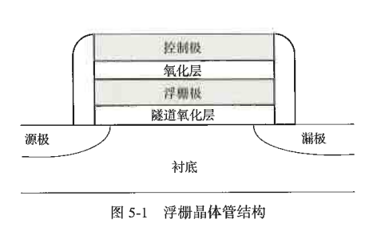
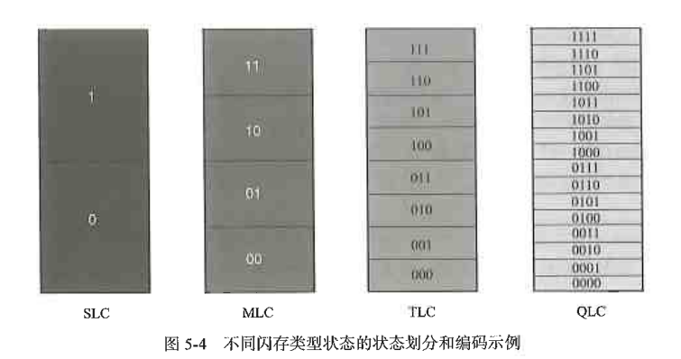
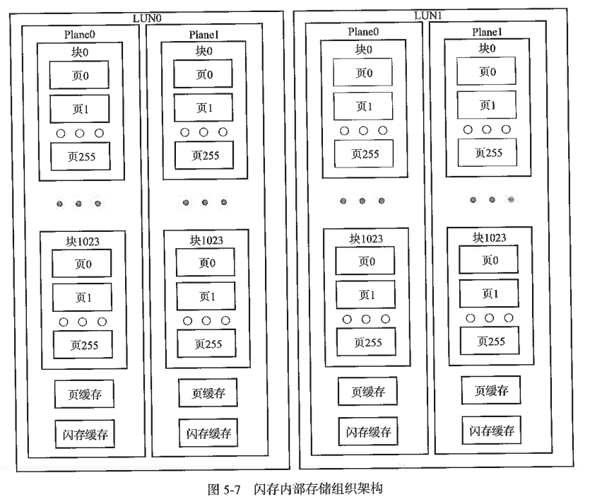
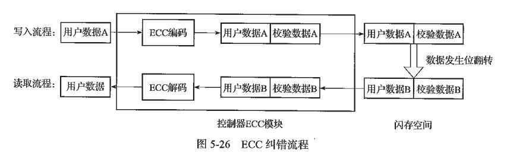
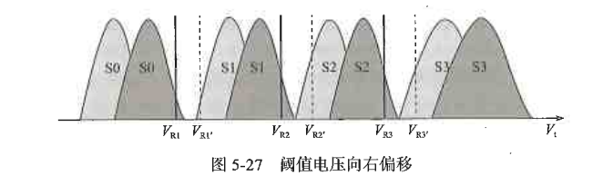
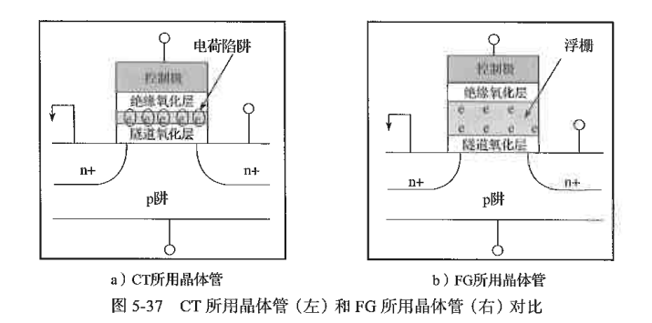

# NAND闪存

---

## 5.1 闪存基本原理(to be continued)

### 5.1.1 存储单元及相关操作

- **控制极 (Control Gate)**  位于最顶层，负责施加电压以控制电子的存取。
- **氧化层 (Oxide Layer)**  绝缘层，隔离控制极与浮栅极。
- **浮栅极 (Floating Gate)** 存储电子的核心区域，电子在此长期保存以表数据。
- **隧道氧化层 (Tunnel Oxide)**  极薄的绝缘层，电子通过“隧道效应”穿过此层进入浮栅。
- **衬底 (Substrate)**  基底层，包含**源极 (Source)** 和 **漏极 (Drain)**。

### 5.1.2 闪存类型

提升闪存存储密度提升方式：

- 物理方式，比如采用 3D 堆叠方式和使用更先进的制程；
- 逻辑方式，即让一个存储单元存储更多位的数据。
  采用这两种方式都能让同样大小的晶圆生产出更多位数据，从而达到降低比特成本的目的。

一个存储单元存储 1 bit位数据的闪存叫 SLC（Single Level Cell），存储 2 bit位数据的闪存叫 MLC，存储 3 bit位数据的闪存叫 TLC ，存储 4 bit位数据的闪存叫 QLC。

SLC 电压状态数 2种，MLC 电压状态数 4 种，QLC电压状态数 8 种， QLC电压状态数 16 种

假设一个存储单元最多注入 100 个电子，我们可以用存储单元中有 0 ～ 10 个电子的状态和有 51 ～ 100 个电子的状态分别表示 1 和 0 两种状态，即表示 1 位数据。如果在这个基础上再细分一下，比如用有 0 ～ 5 个电子、20 ～ 40 个电子、50 ～ 70 个电子和 80 ～ 100 个电子分别表示 4 个状态，每个状态用 2 位来编码，那是不是就能表示 2 位的数据？这就是 MLC 的概念。通过把存储单元划分成更多状态，更精细地控制注入浮栅极的电子个数，可以达到存储更多数据的目的。依此类推，TLC 需要把存储单元划分为 8 种状态，QLC 需要把存储单元划分为 16 种状态，如图 5-4 所示。

### 5.1.3 闪存组织结构

闪存 Die 的组织架构与基本单元：

- 高容量密度：单个 Die 容量已达 256Gb 至 1Tb，由海量存储单元构成。
- 层级结构：一个闪存芯片有若干个 Die（或者叫 LUN），每个 Die 有若干个 Plane，每个 Plane 有若干个块，每个块有若干个页，每个页对应着一条字线且由成千上万个存储单元构成。
- 操作限制：**页是读写操作的最小单位**（主流大小为 16KB+），而**块是擦除操作的最小单位**。

**写在页上，删在块上**是导致 SSD 需要垃圾回收（GC）和写放大（WA）现象的根本物理原因

### 5.1.4 擦、写、读操作

### 5.1.5 值电压分布图

---

## 5.2 闪存可靠性问题

### 5.2.1 磨损

一个闪存块的磨损程度，用擦写次数(PEC)来衡量。
**纠错算法(Error Correct Code)**

- 闪存标称擦写次数（如 3D TLC 的 3000 次）是原厂基于特定纠错能力设定的。其实际寿命并非固定：采用更强的纠错算法可延长寿命；反之，若纠错能力低于原厂设定，寿命则会缩短。可见，闪存寿命与纠错算法强相关。

**数据保持期与磨损均衡**

- 闪存寿命还受**数据保持期**影响。标称次数通常以“数据保存1年”为基准，若仅需临时存放数据，实际擦写次数可大幅提升；若需更长保存期，则擦写次数会相应减少。因此，标称值仅供参考，实际寿命取决于应用场景。
- 此外，为解决闪存块的磨损问题，SSD 固件会采用 **磨损均衡（Wear Leveling）算法** ，确保写入载荷均摊至所有闪存块，防止个别区块因过度擦写过早损坏，从而提升整盘可靠性。

### 5.2.2 读干扰

**读干扰（Read Disturb）原理**：读取闪存页时，需对非目标字线施加 $V_{PASS}$ 电压以保证导通，但这会使晶体管受到轻微“编程”。 随着读取次数增加，电子积累可能会导致位翻转（1 变为 0）。 若翻转位数超过纠错引擎的纠错能力，将导致用户数据丢失。

读干扰直接影响数据可靠性而非闪存寿命。但为解决该问题，固件算法执行的 **"刷新操作"** 会引入额外写入并产生写放大，进而损耗寿命。在读密集场景下，TLC/QLC 等高密度闪存因刷新频繁，即便主机写入量极少，也会导致闪存寿命显著下降。

### 5.2.3 写干扰和抑制编程干扰

**写干扰**：对目标字线编程时，较高电压虽针对特定单元，但也会使同一字线上无需编程的单元因电场作用意外注入电子。它会让编程页上那些不希望编程的存储单元意外地注入电子，导致目标编程页写入错误数据。

**抑制编程干扰**： 是对需要编程的存储单元所在位线上单元的干扰。它会导致其他闪存页注入额外的电子，这可能导致已经编程好的闪存页发生位翻转，也可能导致尚未编程的闪存页处于非干净的擦除状态，不管怎样，最终都会影响数据的可靠性。

### 5.2.4 数据保持

**数据存储**在晶体管中，浮栅极上下被绝缘体包围。随着时间的推移，存储在浮栅极的电子在本征电场的作用下会透过绝缘层“逃逸”，尤其是随着隧道氧化层绝缘效果逐渐变差（擦写次数增多），电子“逃逸”变得越来越容易。电子“逃逸”数目达到一定量时，会导致位“0”翻转成位“1”，当发生位翻转的数目超出控制器的纠错能力时，就会出现用户数据丢失的情况。

**数据保持（电子流失）** ：随时间推移或擦写次数增加，浮栅极电子会透过绝缘层“逃逸”，导致位从“0”翻转为“1”，阈值电压分布整体 **左移** 。
**读干扰（电子注入）** ：因施加电压导致额外电子进入浮栅，使位从“1”翻转为“0”，阈值电压分布整体 **右移** 。
**后果** ：无论哪种情况，一旦翻转位数超过控制器纠错能力，均会导致用户数据丢失。

**数据保存期与固件维护** ：

- **保存期缩短** ：闪存数据保存期随技术演进显著缩短，TLC 时代可能仅剩数月至一年。
- **开机保护机制** ：SSD 固件会定期扫描数据块，若错误率超标即执行“刷新”（搬移并修复数据），防止数据丢失。
- **断电风险** ：电子流失与通电与否无关，但长期关机会导致固件无法运行刷新机制。
- **建议** ：定期开机使用，确保固件有充足时间自动维护并找回因电子流失而受损的数据。

**保持期长短**与 **擦写次数** 与**闪存温度**有关，温度越高电子流失越快。

### 5.2.5 存储单元之间的干扰

浮栅晶体管的浮栅极材料是导体。任何两个彼此绝缘且相隔很近的导体间都会构成一个电容器。因此，任何两个存储单元的浮栅极就构成一个电容器：某一个浮栅极里的电荷发生变化，都会引起其他存储单元浮栅极里的电荷发生变化，尤其是与之相邻的存储单元。

---

## 5.3 数据可靠性问题的解决方案

#### 1.ECC纠错

早期闪存（SLC 或者 MLC 闪存）发生位翻转的情况不是很多，当时主要用的纠错算法是 BCH 算法，它只支持硬解码。后来随着闪存变得越来越不可靠，更强的**纠错算法 LDPC(Low-Density Parity-Check)** 成为 SSD 中的主流纠错算法，它不仅支持硬解码，还支持软解码，纠错能力与 BCH 相比上了一个台阶。

SSD 控制器的一个核心技术就是纠错算法。纠错模块不仅要纠错能力强、功耗低、性能好，还要面积小

#### 2.重读

**重读 (Read Retry)** 机制与电压偏移：

- 核心定义：当 ECC 纠错失败时，固件通过调整控制极的参考电压重新读取数据，而非机械重复。
- 物理背景：以 MLC 为例，读干扰会导致额外电子进入，使闪存页的阈值电压分布整体向右偏移（变大）。此时需通过重读技术寻找新的最优电压判读点。

**重读机制的局限性** ：

- **复杂性** ：实际场景中位翻转因素众多，阈值电压分布并非简单的线性偏移，故厂家需提供多种重读电压选项以应对复杂情况。
- **失效场景** ：重读并非万能，若相邻逻辑状态的电压分布已发生严重重叠（Overlap），则无法通过重读技术恢复原始数据。

#### 3.刷新

固件刷新（Refresh）机制：刷新是固件的一种预防性维护手段。当监测到闪存页/块的出错位数较多（虽尚在 ECC 纠错范围内）时，提前将数据搬移至新位置，防止因位翻转累积超出 ECC 纠错能力而导致数据丢失。

#### 4.RAID

SSD 内部 RAID 机制：当位翻转过多导致 ECC 及常规恢复手段均失效时，SSD 会启用 RAID（独立磁盘冗余阵列）技术作为终极手段。基于 SSD 内部闪存阵列的本质，通过借鉴磁盘阵列技术（通常采用 RAID 5 模式）来重建受损数据，确保数据的完整性。

SSD RAID 5 的特性与实现：

- 能力与局限：目前 SSD 主流采用 RAID 5 及其变种，仅能恢复单个 ECC 不可纠错的数据块；面对多个块同时失效时则无法修复。
- 开销成本：RAID 5 需占用部分闪存空间存储校验数据，且对读写性能有一定影响。
- 普及与实现：随闪存质量下降，RAID 已从企业级下放到消费级。其实现需硬件（控制器支持异或加速以防性能损耗）与固件（综合失效特征与 RAM 资源设计算法）协同完成。

---

## 5.4 3个与性能相关的闪存特性

### 5.4.1 多Plane操作

闪存很早就提供多 Plane 操作命令，以增加读取和写入闪存的并发度，进而提升闪存读写性能。

### 5.4.2 缓存读写操作

### 5.4.3 异步Plane操作

---

## 5.5 3D闪存

### 5.5.1 使用3D技术提高存储密度

### 5.5.2 3D闪存存储单元

在 2D 时代，闪存存储单元是浮栅（Floating Gate, FG）晶体管；而到了 3D 时代，开始使用一种名为电荷捕获（Charge Trap, CT）的新型存储单元。

- **材料区别** ：存储电荷的材料不同，FG 所用晶体管的浮栅极材料是导体，而 CT 所用晶体管存储电荷的是具有高电荷捕获密度的绝缘材料。
- **电子移动性区别**：在 CT 所用晶体管的控制极上施加一个高电压，在强电场作用下把电子注入电荷捕获单元。CT 捕获电子的材料上面就像布了很多陷阱，电子一旦陷入其中，就难以逃脱；而 FG 的浮栅极是导体材料，电子可以在里面自由移动。
  

### 5.5.3 3D闪存组织结构

### 5.5.4 3D闪存外围电路架构
