# FTL详解

---

## 6.1 FTL综述

**FTL(Flash Translation Layer，闪存转换层)** 用于完成主机逻辑地址空间到闪存物理地址空间的翻译，或者说是映射。通过实现**垃圾回收**、**磨损均衡**、**异常掉电处理**等算法，FTL 把 SSD 存储介质特性隐藏起来，使用户使用基于闪存的 SSD 像使用传统 HDD 一样，不用考虑存储介质特性。

闪存块需先擦除才能写入，不能覆盖写(out-of-place update)。当写入一笔新的数据时，不能直接在老地方直接更改(闪存不允许在一个闪存页上重复写入)，必须写到一个新的位置。

```
电子：只能由 1 变 0 在物理层面上，闪存单元(Cell)默认的擦除状态是逻辑 "1"(浮栅/电荷捕获层中没有电子，或者处于低电压态)。
编程(写)：实际上是向存储单元注入电子的过程。这个过程只能把状态从 1 变成 0。
无法逆向：写操作无法把电子“吸出来”让 0 变回 1。想要变回 1，必须执行“擦除”操作(施加反向高压驱散电子)。

操作层面：读写操作的最小单位是页 (Page)(通常 16KB)。擦除操作的最小单位是块 (Block)(通常包含几百甚至上千个页)。
为什么不能只擦除一页？ 为了追求高密度和低成本，NAND Flash 在电路设计上，一个 Block 内的所有存储单元共用同一个基板。
擦除时需要对基板施加高电压，这导致一通电，整个 Block 里的几百个 Page 全都被“洗白”成了 1。
```

NAND 闪存特性

- 闪存块需要先擦除才能写入，不能覆盖写
- 闪存块都是有一定寿命
- 存在读干扰问题
- 存在数据保持问题
- 存在坏块
- QLC或者TLC可以配成SLC使用

FTL 的两种实现方式：(主流SSD采用Device-Based FTL)

- Host-Based (基于主机)：FTL 算法在主机端运行，消耗计算机的 CPU 和内存资源。通常需要厂商与用户深度定制，主要用于企业级产品。
- Device-Based (基于设备)：FTL 算法在 SSD 控制器内部运行，利用 SSD 自带的 RAM 资源。核心作用：作为固件中间层，将前端主机的逻辑读写请求，转换为对后端闪存的读写请求。

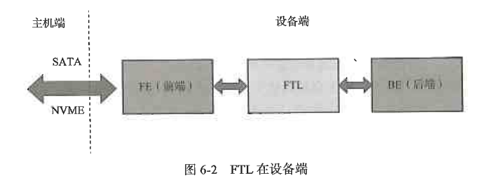

---

## 6.2 映射管理

### 6.2.1 映射的种类

FTL根据映射粒度的不同分为 **块映射**，**页映射**和**混合映射**

页映射以闪存页为映射粒度，一个逻辑页可以映射到任意一个物理页中，因此每一个页都有一个对应的映射关系。由于闪存页远比闪存块多(一个闪存块包含几百甚至几千个物理页)，因此需要更多的空间来存储映射表。但它的性能更好，尤其体现在随机写上面。为追求性能，SSD 一般都采用页映射。

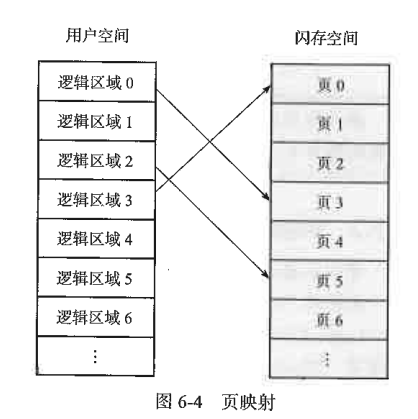

- 在实际场景中，逻辑区域可能小于内存页大小，一个内存页可容纳若干个逻辑区域数据。

不同映射方式对比表

| 对比项               | 块映射 | 页映射 | 混合映射 |
| :------------------- | :----: | :----: | :------: |
| **映射单元**   | 闪存块 | 闪存页 | 块页结合 |
| **顺序写性能** |   好   |   好   |    好    |
| **顺序读性能** |   好   |   好   |    好    |
| **随机写性能** |  很差  |   好   |    差    |
| **随机读性能** |   好   |   好   |    好    |
| **映射表大小** |   小   |   大   |   一般   |

### 6.2.2 映射的基本原理

### 6.2.3 HMB

### 6.2.4 映射表写入

---

## 6.3 垃圾回收

### 6.3.1 垃圾回收原理

本节虚构一个迷你 SSD 空间来辅助讲解垃圾回收原理，以及与之紧密联系的 WA 和 OP 等概念。


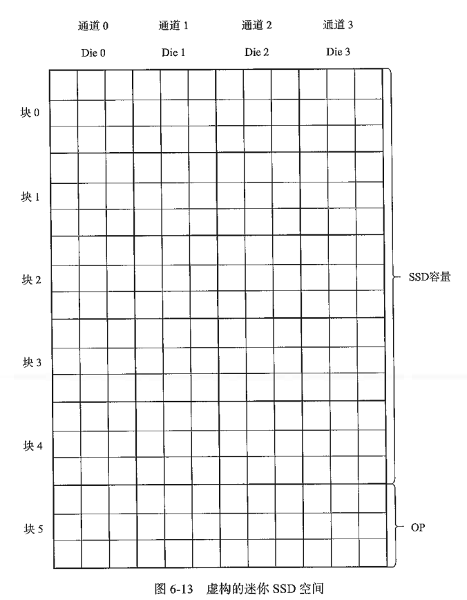
<p style="line-height: 1.8; font-size: 18px;">
我们假设迷你 SSD 底层有 4 个通道(通道 0～3)，每个通道上各挂了 1 个 Die(Die 0～3，它们可并行操作)，假设每个 Die 只有 6 个闪存块(块 0～5)。每个闪存块内有 9 个小方块，每个小方块的大小和逻辑页大小一样。24 个闪存块中，我们假设其中的 20 个闪存块大小为 SSD 容量，就是主机端看到的 SSD 大小；另外 4 个闪存块是超出 SSD 容量的预留空间，我们称之为 OP。
</p>

<br clear="all" /> 


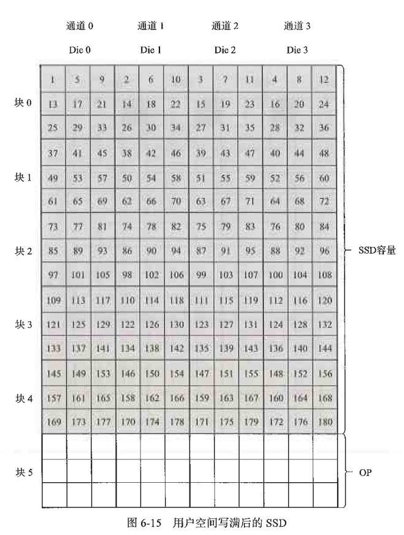
<p style="line-height: 1.8; font-size: 18px;">
我们顺序写入 4 个逻辑页，分别写到不同通道上的 Die 上，这样写的目的是增加底层的并行度，提升写入性能。
用户继续顺序写入数据，固件把数据交错写入到各个 Die 上，直到写满整个 SSD 空间(主机端看到的)。
整个盘写满了(从用户角度来看，整个用户空间写满了，但在闪存空间，由于预留空间的存在，并没有写满)，如果我们想写入更多数据，怎么办？只能删除一些旧文件，腾出写入空间。
删除部分文件后，我们继续写入数据。
</p>

<br clear="all" />


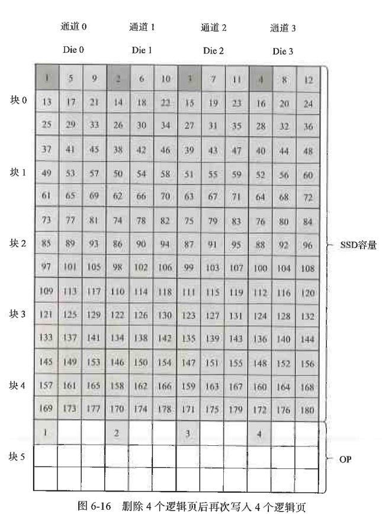


<p style="line-height: 1.8; font-size: 18px;">
假设还是从逻辑页 1 开始写入。由于闪存不能在原位置原地更新，固件只能另找闪存空间写入新的数据，因此这个时候 SSD 会把新写入的逻辑页 1～4 写入 SSD 预留空间。对 SSD 来说，不存在什么用户空间和预留空间，它只能看到闪存空间。从主机端来的数据，SSD 就往可用闪存空间写。如图 6-16 所示，出现了深色方块，怎么回事？因为逻辑页 1～4 的数据已更新，写到新的地方，之前位置上的逻辑页 1～4 上的数据就失效了，变为垃圾数据了。
继续顺序写入，深色方块越来越多(垃圾数据越来越多)。当所有闪存空间都写满后，迷你 SSD 就变成图所示的样子。

</p>

<br clear="all" />


等所有 Die 上的块 5 写满后，所有 Die 上的块 0 也全部变成深色了(这些都是垃圾数据)。
现在不仅整个用户空间都写满了，整个闪存空间也也都写满了。如果用户想继续写入后续的逻辑页，就得进行垃圾回收了
- 在实际场景中，是不会等所有闪存空间都写满后才开始做垃圾回收的，而是在写满之前就触发垃圾回收机制，这里只是为描述垃圾回收而做的假设。


**垃圾回收(GC)**
垃圾回收的核心逻辑是通过“数据搬移”与“整块擦除”来循环利用存储空间。
- 识别与搬移：系统首先寻找一个空闲的可用块 $z$，随后将分散在旧块(如块 $x$ 和块 $y$)中的有效数据(A、B、C 及 D、E、F、G)统一读取并重写至块 $z$ 中。
- 清理与释放：搬移完成后，块 $x$ 与块 $y$ 中仅剩下无效数据(垃圾)，此时 FTL 触发擦除指令，将这两个块恢复为可用的空白状态。
- 核心价值：通过占用 1 个新块的物理空间，成功置换出 2 个全新的可用块，以极小的存储代价换取了更多的连续写入空间。

<p align="left">
  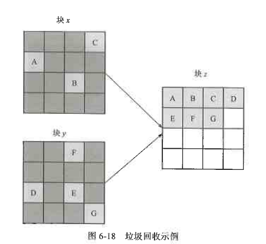
  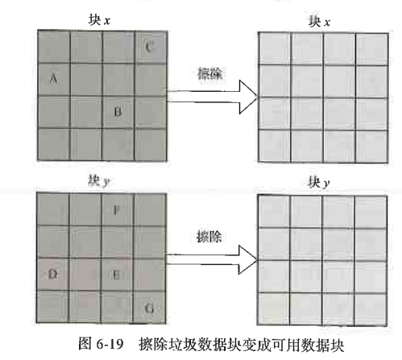
</p>

由于我们采用的是顺序写入，垃圾集中在块 0 上，上面没有任何有效数据，我们把它们擦除就可以腾出新的写入空间——SSD 内部可以把新的数据写入垃圾回收完成的块 0 上了。从这个例子中我们可以看到：顺序写，即使是闪存空间写满后的写，性能也是比较好的，因为垃圾回收可以很快完成（也许只要一个擦除动作）。

但现实是残酷的，用户还是可能随机写入数据。下面是一个闪存空间经历随机写满后的样子。


<p align="left">
  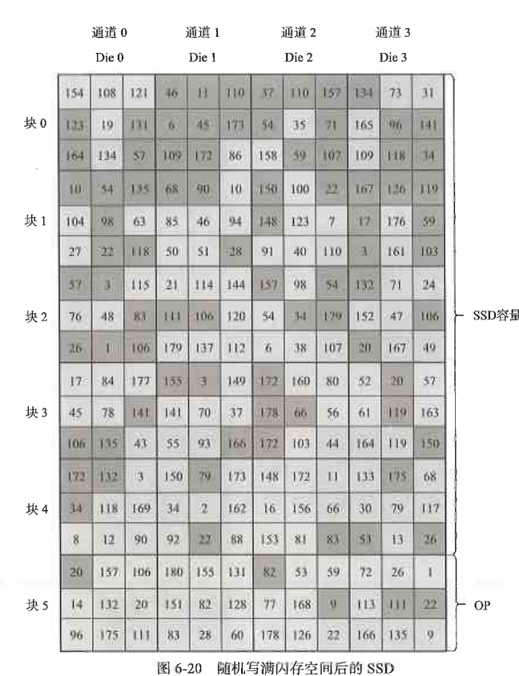
  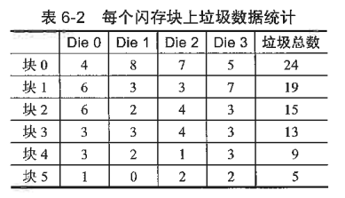
</p>


- 随机写后的 GC 挑战：随机写入导致垃圾数据（无效页）碎片化地分散在各个物理块中，无法像顺序写那样直接整块擦除。
- 回收策略（贪心算法）：为了最大化回收效率，固件会优先挑选“垃圾比例最高”的块进行回收。
- 效率原则：垃圾越多意味着块内的有效数据越少，搬移这些有效数据所产生的读写开销（代价）就越小，释放空间的速度也就越快。
- 数据量化：通过建立垃圾统计表，FTL 可以清晰地识别出哪些物理块（如表中的“块 0”）是当前最优的回收对象。

### 6.3.2 写放大

垃圾回收会引入写放大问题：用户要写入一定量的数据，SSD 为了腾出空间写这些数据，需要额外做一些数据搬移工作，结果就是 SSD 往闪存中写入的数据量比实际用户写入 SSD 的数据量要大。因此，我们 SSD 中有一个重要参数——写放大系数，计算公式如下：

$$WAF = \frac{\text{SSD 写入闪存的数据总量}}{\text{主机请求写入的数据总量}}$$

典型状态 (WAF > 1)：主机请求写入 4 页新数据。但 SSD 已满，必须通过 GC 腾出空间。
- 为了腾出空间，SSD 内部先搬移了 6 页原有的有效数据到新块。随后写入主机请求的 4 页新数据。
- 结果：主机只写了 4 页，但闪存物理上处理了 $6 + 4 = 10$ 页的写入。计算：$WAF = 10 \div 4 = 2.5$。

**SandForce 控制器**内部具有实时数据压缩模块，它能对用户写入的数据进行实时压缩，然后再把它们写入闪存，因此写放大系数可以做到小于 1。

写放大系数（WAF） 过大会加速闪存磨损并缩短 SSD 寿命，同时因占用底层带宽而拖慢写入性能。
减小写放大系数方式：
- 可以使用前面提到的压缩办法（由主控决定），
- 另外顺序写也可以减小写放大系数（顺序写可遇不可求，取决于用户写入负载）。
- 还可以增大 OP 来减小写放大系数（这个可控）。


$$OP \text{ 比例} = \frac{\text{闪存空间} - \text{用户空间}}{\text{用户空间}} $$

OP 与写放大：OP 比例越高，单个闪存块内的有效数据占比就越低，垃圾回收（GC）时需搬移的数据量显著减少，从而直接降低写放大系数，但OP比率越高意味着更多的额外空间，也是更多的成本。
- 性能增益：由于减少了内部数据搬运，SSD 在满盘状态下的持续写入性能也会随之提升。
- 消费级 SSD：由于对价格极度敏感，通常仅保留约 7% 的最小化 OP，牺牲了极端情况下的稳态性能。
- 企业级 SSD：为了追求极致的稳态性能和低延时，会牺牲大量用户容量来分配高达百分之几十的 OP。


### 6.3.3 垃圾回收实现

垃圾回收三步走：
- 挑选：确定需要回收的源闪存块。
- 查找：识别该块内的有效数据。
- 搬移：将有效数据重写至新的目标块。

最优挑选策略（贪心算法）：优先选择“有效数据最少”的块，以最小化重写负担，从而确保 写放大系数（WAF） 降至最低。
数据维护逻辑：为了实时掌握各块状态，固件必须动态维护一张**有效数据计数表**。当新数据写入新块时，目标块计数自增1；若该操作属于更新写入，则还需追溯旧数据所在块并更新其状态将原闪存块计数减1。


垃圾回收效率优化：除了通过记录“有效数据总量”来筛选闪存块外，固件还引入了**位图表（Bitmap）**来精准定位块内的有效页。

**位图表**：位图表中的每个**比特位**（bit）对应一个**物理页**。在执行 GC 搬移时，固件无需逐页扫描，只需根据位图信息即可直接提取有效数据进行重写。
动态更新逻辑：
- 数据写入：当新数据写入某闪存块时，其对应比特位置 1（标记为有效）。
- 数据更新：由于闪存异地更新特性，同一逻辑地址写入新页会导致旧页失效，此时必须将原闪存块对应的比特位置 0（标记为无效）。
在写入逻辑页1，2，3，4时，不仅更新块5的位图还把块0(逻辑页1，2，3，4之前的闪存块)对应位置0

<p align="left">
    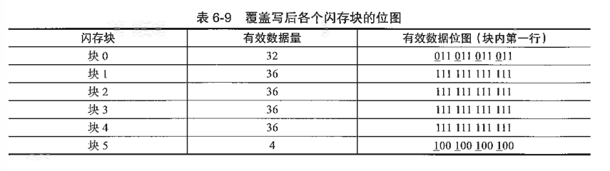
    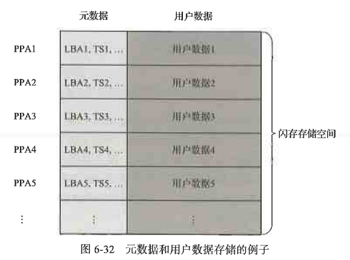
</p>

位图的存储问题：实际物理块包含数千个闪存页，位图体积随之剧增:
- 带 DRAM 的 SSD：可轻松容纳庞大的位图数据。
- DRAM-less（无缓存）SSD：由于控制器内部 SRAM 容量有限，必须频繁进行位图的“换入换出”操作，极大增加了固件管理的复杂度与性能开销。
- 备选方案：利用元数据（Meta Data）：若不采用位图，固件在垃圾回收时需通过读取数据包中携带的元数据（如逻辑地址、时间戳 TS 等）来判定数据是否有效。

数据存储结构：闪存中并非只存储纯用户数据，而是将**用户数据**与**元数据**打包存储，以便在没有位图的情况下依然能够识别数据的有效性。


### 6.3.4 垃圾收时机

---

## 6.4 解除映射关系

---

## 6.5 磨损均衡

**磨损均衡(Wear Leveling)** 核心逻辑：
- 必要性：由于闪存块擦写次数（EC）有限，需防止特定块因频繁擦写提前损坏，从而延长 SSD 整体寿命。
- **动态算法(Dynamic Wear Leveling)**：将“热数据”（频繁更新的数据）写入“年轻块”（EC 小的块），通过日常写入自然平衡各块寿命。
- **静态算法(Static Wear Lebeling)**：针对长期不动的“冷数据”，固件会主动将其搬移至“年老块”（EC 大的块），以此“腾出”原本被占用的年轻块来接收新数据，确保所有物理块的磨损程度高度一致。
- 演进：随着 TLC/QLC 寿命缩短，该算法已成为 SSD 稳定性的核心支柱。


固件一般使用**垃圾回收**机制来做**静态磨损均衡**，只不过它挑选源闪存块时，不是挑选有效数据最小的闪存块，而是挑选冷数据所在的闪存块。其他处理方法和垃圾回收差不多，即读取源闪存块上的有效数据，然后把它们写到擦写次数相对较大的闪存块上。

当然，也可以采用复制的方式，即把冷数据从年轻的块复制到年老的块。和做垃圾回收方式相比，复制方式不管数据是否有效，都原封不动地搬到目标块。这样做的好处是实现简单，不用走垃圾回收流程，不用更新映射关系，因为数据在块中相对位置是固定的，所以只需做简单的块映射；不好的地方是多搬了垃圾数据。但对冷数据所在块来说，垃圾不会太多（否则，它之前就被挑中去做垃圾回收了），这个代价是可以接受的。


---

## 6.6 掉电恢复

---

## 6.7 坏块管理

---

## 6.8 SLC缓存

---

## 6.9 读干扰和数据保持
