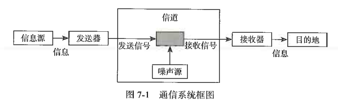
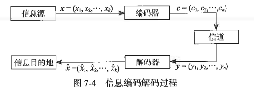
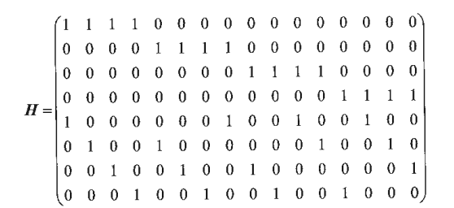
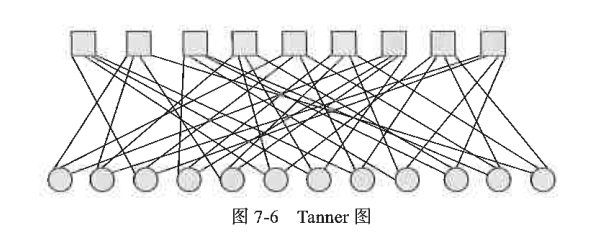

# ECC原理

所有型号的闪存都无法保证存储的数据会永久稳定，这时候就需要 ECC(纠错码)去给闪存纠错。ECC 能力的强弱直接影响 SSD 的使用寿命和可靠性。本章将简单介绍 ECC 的基本原理和目前主流的 ECC 算法——LDPC。

---

## 7.1 信号与噪音

---

## 7.2 通信系统模型

SSD 存入和读出信息也是一个通信系统。信息是用户写入的原始数据，经过 SSD 后端的发送器处理后转化为闪存的指令，信号就是闪存上存储的电荷，电荷存储时会有自身泄漏问题，在读的过程中会受到周围电荷的影响，这是闪存的信道特性，最后数据通过 SSD 后端的读取接收器完成读取过程。

两种核心信道模型：
- BSC(binary symmetric channel)：特征是“错误”。即收到的位发生了翻转(0 变 1 或 1 变 0)，接收方无法仅凭收到的值确定原始数据是否正确。
- BEC(binary erasure channel)：特征是“丢失”。如果收到数据，则该位百分之百正确；如果发生错误，接收方会明确知道该位数据已丢失(无法读取)，而非错误的位翻转。

SSD信道一般采用BSC，认为闪存信号存在一定概率的位翻转
为了让信息从源头经过噪声信道后准确到达目的地，要对信息进行编码，增加冗余保护信息。

---

## 7.3 纠错编码的基本思想

### 7.3.1 编码距离

### 7.3.2 线性纠错码的基石-奇偶校验

### 7.3.3 校验矩阵H和生成矩阵G

---

## 7.4 LDPC原理简介

### 7.4.1 LDPC是什么
LDPC(Low Density Parity-Check Code)低密度奇偶校验码。
- 正则LDPC编码 校验矩阵每行固定有 J 个1，每列固定有 K 个 1
- 非正则LDPC编码 没有上述规则

码长(n):16
校验位(m,n-k):8
码率(R):8/16 = 0.5

### 7.4.2 Tanner图

---

## 7.5 LDPC解码

- 硬判决解码(hard decision decode) 
- 软判决解码(soft decision decode)

### 7.5.1 Bitflipping算法(hard decision decode)

### 7.5.2 和积信息传播算法(soft decision decode)

---

## 7.6 LDPC编码

一般先确定H矩阵，再反推生成矩阵G 

---

## 7.7 LDPC纠错码编解码器在SSL中的应用
