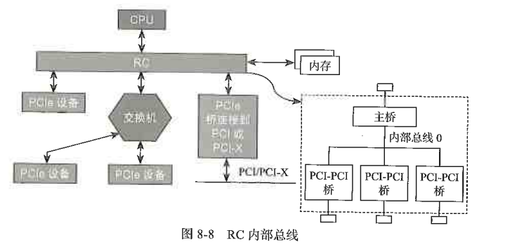
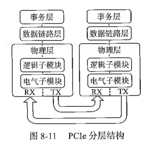
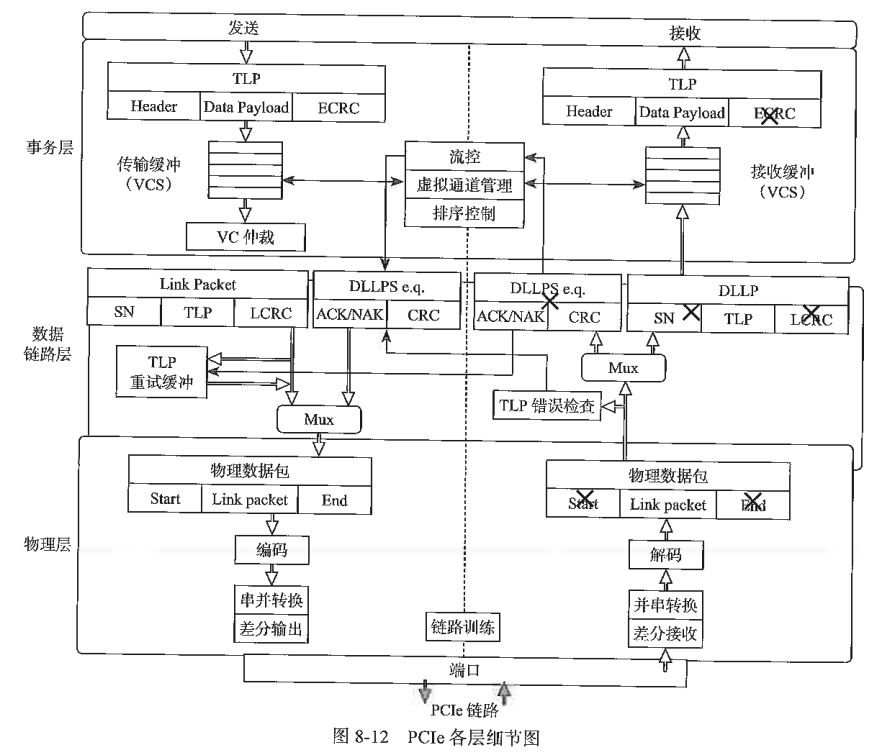
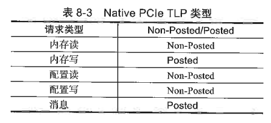

# PCIe介绍

---

## 8.1 从PCIe的速度说起

---

## 8.2 PCIe拓扑结构

整个 PCIe 拓扑结构是一个树形结构。Root Complex（RC）是树的根，它为 CPU 代言，与整个计算机系统的其他部分通信，比如 CPU 通过它访问内存，通过它访问 PCIe 系统中的设备。

---

## 8.3 PCIe分层结构

PCIe 传输的数据从上到下，都是以数据包（Packet）的形式传输的，每层数据包都有其固定的格式。
**事务层**的主要职责是：创建（发送）或者解析（接收）TLP（Transaction Layer Packet，事务层数据包）、流量控制、QoS、事务排序等。
**数据链路层**的主要职责是创建（发送）或者解析（接收）DLLP（Data Link Layer Packet，数据链路层数据包）、ACK/NAK 协议（链路层检错和纠错）、流控、电源管理等。
**物理层**的主要职责是处理所有的数据包中数据的物理传输，发送端数据分发到各个 Lane 中进行传输，接收端把各个 Lane 上的数据汇总起来，在每个 Lane 上进行加扰（Scramble，目的是让 0 和 1 分布均匀，去除信道的电磁干扰）、去扰（De-scramble），以及 8/10 或者 128/130 编码解码等操作。

---

## 8.4 PCIe TLP类型

主机与 PCIe 设备之间，或者不同 PCIe 设备之间，数据传输都是以数据包形式进行的。事务层根据上层（软件层或者应用层）请求（Request）的类型、目的地址和其他相关属性，把这些请求打包，产生 TLP。然后这些 TLP 往下经过数据链路层、物理层，最终到达目标设备。

根据软件层不同的请求，事务层可产生 4 种不同的 TLP 请求：

- 内存（Memory）；
- I/O；
- 配置（Configuration）；
- 消息（Message）。

前 3 种分别用于访问内存空间、I/O 空间、配置空间，这 3 种请求在 PCI 或者 PCI-X 时代就有了，最后的消息请求是 PCIe 新加的。在 PCI 或者 PCI-X 时代，像中断、错误以及电源管理等相关消息，都是通过边带信号（Sideband Signal）进行传输的，但 PCIe 干掉了这些边带信号线，所有的通信都以带内信号的形式传输，即通过数据包传输。因此，过去一些用边带信号传输的数据，比如中断消息、错误消息等，现在就交由消息来传输了。

Non-Posted TLP 需要对方响应
Posted TLP 不需要对方响应

---

## 8.5 PCIe TLP结构

---

## 8.6 PCIe配置和地址空间

---

## 8.7 TLP的路由

---

## 8.8 数据链路层

---

## 8.9 物理层

---

## 8.10 PCIe重置

---

## 8.11 PCIe最大有效载荷和最大读请求

---

## 8.12 PCIe SSD热拔插

---

## 8.13 SSDPCIe链路性能损耗分析

---

## 8.14 PCIe省电模式ASPM

---

## 8.15 PCIe其他省电模式

---

## 8.16 PCIe 4.0和5.0介绍

---

## 8.17 SRIOV
