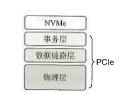
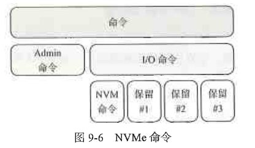
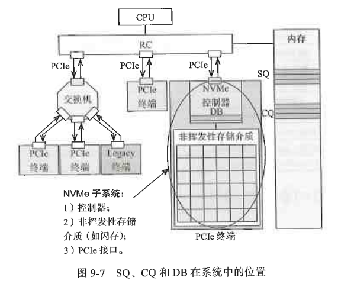

# NVMe介绍

---

## 9.1 AHCI到NVMe 

---

## 9.2 NVMe综述

NVMe是一种主机与SSD之间通信的协议，它在协议栈中属高层。

NVMe命令

命令有了，那么，主机又是怎么把这些命令发送给 SSD 执行的呢？
NVMe 有三宝——Submission Queue（SQ，提交队列）、Completion Queue（CQ，完成队列）和 DoorBell register（DB，门铃队列）。SQ 和 CQ 位于主机的内存中，DB 则位于 SSD 的控制器内部

---

## 9.3 吉祥三宝SQ、CQ和DB

---

## 9.4 寻址双雄PRP和SGL

---

## 9.5 Trace分析

---

## 9.6 端到端数据保护

---

## 9.7 Namespace

---

## 9.8 NVMe动态电源管理

---

## 9.9 NVMe over Fabrics

---

## 9.10 ZNS简介

---

## 9.11 CMB和HMB简介

---

## Key Value命令集简介