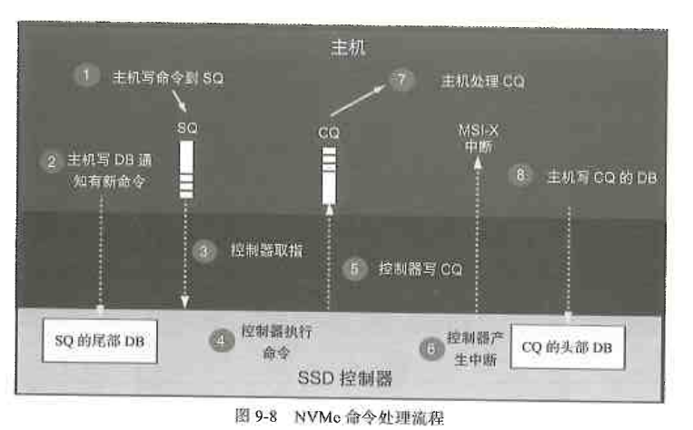

# NVMe介绍

---

## 9.1 AHCI到NVMe 

---

## 9.2 NVMe综述

NVMe是一种主机与SSD之间通信的协议，它在协议栈中属高层。

NVMe命令

命令有了，那么，主机又是怎么把这些命令发送给 SSD 执行的呢？
NVMe 有三宝——Submission Queue（SQ，提交队列）、Completion Queue（CQ，完成队列）和 DoorBell register（DB，门铃队列）。SQ 和 CQ 位于主机的内存中，DB 则位于 SSD 的控制器内部

NVMe处理命令步骤
- 主机写命令到SQ
- 主机写SQ的DB，通知SSD取指
- SSD收到通知后，到SQ取指
- SSD执行命令
- 指令执行完成，SSD往CQ写指令执行结果
- SSD发中断通知主机指令完成
- 收到中断，主机处理CQ，查看指令完成状态
- 主机处理完CQ中的指令执行结果，通过DB回复SSD

---

## 9.3 吉祥三宝SQ、CQ和DB

- SQ (Submission Queue)：提交队列，主机发送指令。
- CQ (Completion Queue)：完成队列，SSD 返回结果。
- Admin 队列：固定 1 对，负责管理工作。
- I/O 队列：最高可达 65535 对，负责数据传输。

---

## 9.4 寻址双雄PRP和SGL

---

## 9.5 Trace分析

---

## 9.6 端到端数据保护

---

## 9.7 Namespace

---

## 9.8 NVMe动态电源管理

---

## 9.9 NVMe over Fabrics

---

## 9.10 ZNS简介

---

## 9.11 CMB和HMB简介

---

## Key Value命令集简介