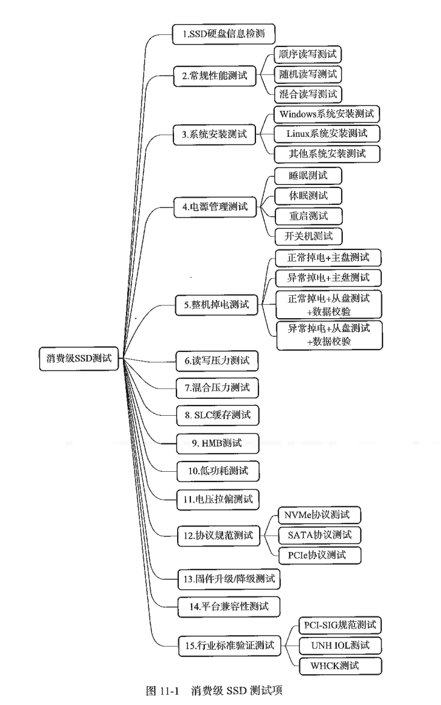
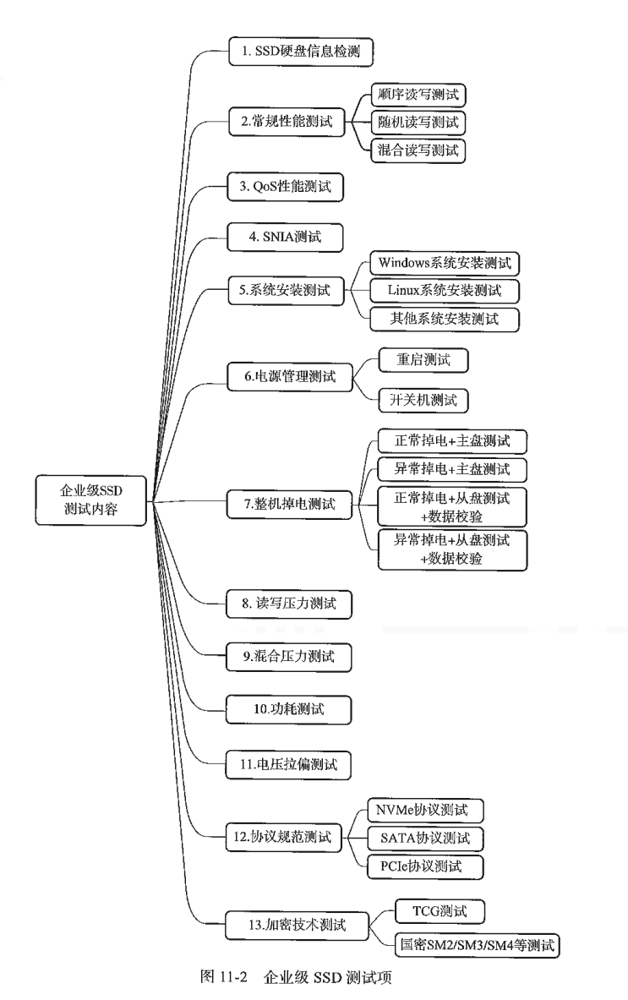

# SSD测试(to be continued)

---

## 11.1 初始SSD测试

SSD 测试的两大维度：
**协议验证测试**：

- 目标：确保 SSD 符合行业接口标准（如 PCIe、NVMe）。
- 手段：通过大量测试脚本验证软硬件功能设计的合规性。

**系统应用测试**：

- 目标：模拟真实使用场景，验证产品核心参数（性能、延迟、可靠性等）。
- 重要性：直接关联用户体验，该阶段发现的问题被视为重大缺陷，因为它们最接近终端用户的真实反馈。

### 11.1.1 协议验证测试

主流 NVMe SSD 来说，要进行 **NVMe 协议验证测试**，测试工程师需要精准、高效地发送 NVMe 协议命令，配置各种命令参数，设计出包含多种命令的测试用例，通过这些测试用例来检验 SSD 对 NVMe 命令的处理能力。

协议测试还需要一个好的测试平台。测试工程师通过测试平台提供的各种接口，针对上层协议命令开发出一个个测试脚本。一套好用的测试平台，会让测试脚本开发变得轻松。

### 11.1.2 系统应用测试

系统应用测试的特点与手段：

- 测试内容：涵盖**性能**、**读写压力**、**掉电测试（正常/异常）**、**数据校验**、**QoS** 等多项指标，模拟真实操作环境。
- 实施难度：门槛相对较低，普通用户日常的下载、复制操作本质上就是压力测试；但因缺乏底层命令接口，难以精准构建特定协议级场景。
- 核心价值（“狠”）：通过高强度的压力测试和“残暴”的用例设计，强制暴露 SSD 在极限负载下才可能出现的深层次设计缺陷。
- 间接验证：对于无法直接访问的内部接口，通过 SSD 的外部行为表现来间接评估其设计质量。

### 11.1.3 SSD的主要测试内容

  
  

---

## 11.2 SSD常规性能测试

### 11.2.1 消费级SSD性能测试

### 11.2.2 企业级SSD性能测试

#### FIO

FIO 是jens开发的一个开源测试工具，功能强大。

#### Vdbench

Vdbench 和 FIO 一样，也是一款被高频使用的读写测试工具，可用于文件系统和块设备基准性能测试和数据完整性验证，在 SSD 行业中使用较为普遍。Vdbench 是用 Java 语言编写的，由 Oracle 公司 Henk Vandenbergh 开发并维护。

### 11.2.3 SNIA测试

### 11.3.1 写放大测试

### 11.3.2 垃圾回收测试

### 11.3.3 磨损均衡测试

---

## 11.4 掉电恢复测试

### 11.4.1 SSD掉电恢复测试

### 11.4.2 整机掉电测试

- powershark
- OakGate (Teledyne LeCroy) platform
- DriveMaster (ULINK) platform
- fio 
- vdbench

---

## 11.5 数据完整性测试

---

## 11.6 回归测试

SSD 固件研发工作的人都挺不容易的：
- 有新的功能要加代码；
- 有 Bug 要改代码；
- 需求变了要改代码；
- 优化性能更要改代码。
这样改来改去就有可能把本来没问题的地方改出问题。比如，改 Bug B 的时候，把上个月解决的 Bug A 给重新放出来了，或者新创建了一个 Bug C。

这种改代码出现副作用的情况，在 SSD 固件开发过程中几乎不可避免。
**回归测试（Regression Test）**
- 确保新的代码没有影响原有功能；
- 从现有功能的测试用例中选取部分或者全部进行测试。

每次发布新的固件，能够把之前所有测试全部跑一遍当然最好，但凡是干过测试的都知道这是不可能的，需要进行平衡
- 测试那些经常失败的项目；
- 用户肉眼可见的测试方式，比如跑 Benchmark；
- 对核心功能进行测试；
- 测试那些目前正在进行或者刚完成的功能；
- 对数据完整性进行测试——R/W/C；
- 测试边界值。

---

## 11.7 DevSlp测试

---

## 11.8 PCISIG测试

---

## 11.9 耐久度测试

---

## 11.10 验证与确认

---

## 11.11 测试设备与仪器
