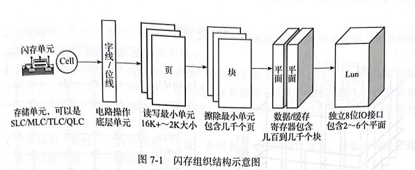
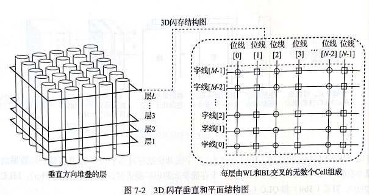
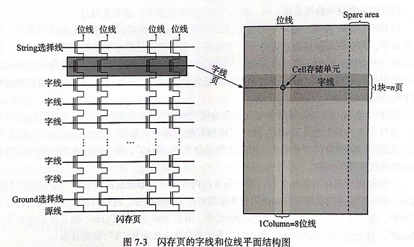
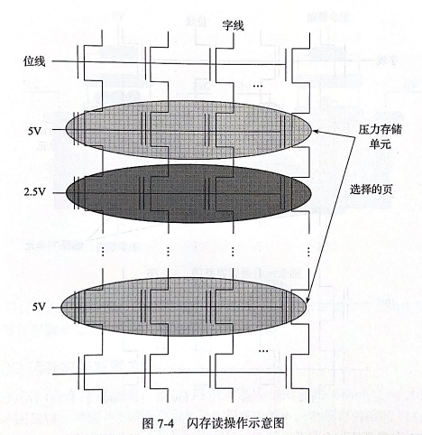
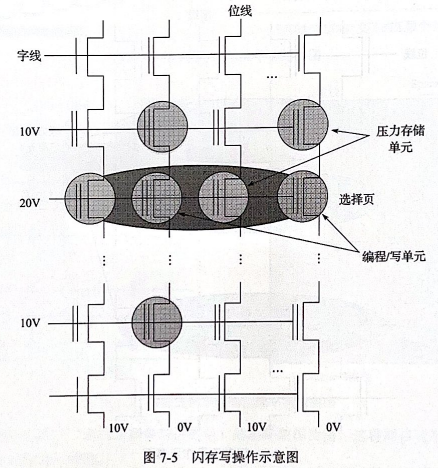
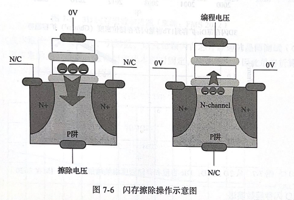

# 闪存及其测试

---

## 7.1 闪存概述

### 7.1.1 闪存组织结构

闪存由 Die/Lun、 平面 （Plane）、 块 （Block） 和页 （Page） 组成， Die 或Lun 是用户对闪存操作的最小实体， 是闪存接收命令的最小单元。 一个 Die 或 Lun 下面可以有多个平面， 一个平面下面有多个块， 一个块下面有多个页

Die或Lun 通过独立的10 数据和命令接口连接到主机或主控端， 它是接收命令的最小的实体单元； Die 或Lun 下面的平面是命令执行操作的基础单元， 它内部有闪存命令操作的执行电路， 同时平面中包含数据和缓存寄存器， 用来接收和缓存用户读写的数据。

字线控制存储单元的门， 而位线则参与这些单元的实际数据传输。 这种网格状结构可实现闪存的高密度和高效访问特性。

1. 闪存读操作底层电路执行动作

- 选择线(Select Line)操作:选择线是通过控制门电压来选择特定的存储单元。在读取数据之前，需要通过选择线选中将要读取的存储单元。
- 字线操作:字线是负责传递读取或写人的数据的线路。在读操作中，需要通过控制字线来读取存储单元中的数据。
- 位线操作：位线是连接存储单元的线路，负责传递数据。在读取操作中，通过位线将存储单元中的数据传递到读取电路中。
- 感应放大器（Sense Amplifier）操作：读取的数据通常是弱信号，为了增强这个信号，需要使用放大器。感应放大器会增强从存储单元读取的数据信号，使其能够被后续电路正确处理。存储单元中的不同二进制数据所表达的电压水平不同，感应出不同的电压代表不同的二进制数据。
- 数据输出：最终，经过选择线、字线、位线和放大器的联合操作，读取的数据会被传递到输出端，供上层系统使用。

2.闪存写操作的底层电路执行动作

- 擦除：在进行闪存写操作之前，通常需要先擦除目标存储单元。擦除是将存储单元的位设置为初始状态的过程，以确保新数据的正确写人。
- 字线充电：写操作开始时，相应的字线被充电，这是通过向目标存储单元的控制栅极施加电压来实现的。充电字线是为接收数据做准备并确保数据能够被正确写人。
- 位选择：选择需要写人的目标存储单元。这是通过将相应的位线激活并选择相关的位线来实现的。
- 数据写入：通过在选定的位上引入电荷，改变存储单元的状态，从而实现数据的写入。这通常涉及在晶体管中充入电荷，以便在介质中存储数据。
- 校验和刷新：写入完成后，会进行校验操作以确保数据的正确性。有时，还可能需要刷新相关的电路或存储单元，以确保数据被正确保持。

3. 闪存擦除操作的底层电路执行动作

- 激活选择字线：擦除开始时，特定的选择字线被激活，以确定要擦除的存储单元。
- 加电擦除栅（Erase Gate）：当擦除操作发生时，P阱被加电。这个动作是为了创建足够的、足以在存储单元中引起电荷移动的电场强度。
- 断开位线：为了确保擦除过程中存储单元中的电荷能够被完全清除，与擦除栅相连的位线会被断开。这样一来，存储单元的电荷可以自由地流向大地，这是一个放电过程，可实现数据的擦除。
- 电荷移动：随着擦除栅的加电，电荷在存储单元中移动，并逐渐被排放。这导致存储单元的物理状态全部变为 “1”。
- 擦除完成：一旦擦除栅的作用使得存储单元中的电荷几乎被完全移除，擦除操作就完成了。此时，选择线和擦除栅会被恢复到初始状态，准备进行下一轮的读写操作。

### 7.1.2 3D闪存未来发展之路

### 7.1.3 3D闪存发展的未来挑战

---

## 7.2 闪存失效模式

---

## 7.3 闪存测试

### 7.3.1 闪存芯片测试流程

- WAT
- CP
- FT

### 7.3.2 闪存品质测试

### 7.3.3 闪存导入测试

### 7.3.4 闪存性能测试

### 7.3.5 闪存功耗测试
